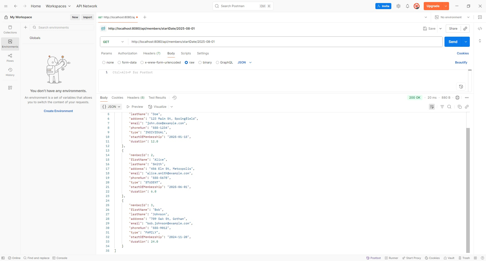

# Screenshots

## App Deployment

### Tests Running

### Docker Container with MySQL Running

### Project Running

### Pushed to Docker Hub

### RDS Deployment Attempt (As far as I could get)

## Member Request Mappings

### Get All Members

### Get Member By ID

### Get Member By Full Name

### Get Members By Type

### Get Member By Email

### Get Member By Phone Number

### Get Member By Tournament Start Date

### Create a New Member

### Update an Existing Member

### Delete a Member

## Tournament

### Get all tournaments

### Get tournament by ID

### Search by name

### Search by start date

### Search by location

### Get members in a tournament

### Add members to a tournament

### Create a tournament

### Update a tournament

### Delete a tournament

## Database (MySQL)

## Members Table

## Tournaments Table

## Tournament Participants Table
